# 🚀 Claude Code Configuration - AIDD Development Environment

## 🎯 AI-Driven Development (AIDD) Framework v3.0

**Methodology**: Complete AI-driven workflow for building high-quality applications 2-5x faster while maintaining enterprise-grade standards.

## 🔄 AIDD Development Lifecycle

```mermaid
graph LR
    A[🎯 00_vibe<br/>Vision & PRD] --> B[🚀 01_onboard<br/>Memory Bank]
    B --> C[🔍 02_context<br/>Generate Rules]
    C --> D[📋 03_plan<br/>Implementation Plan]
    D --> E[💻 04_code<br/>Feature Development]
    E --> F[🔍 05_review<br/>Code Quality]
    F --> G[🧪 06_tests<br/>Test Generation]
    G --> H[📝 07_documente<br/>Update Memory]
    H --> I[🚀 08_deploy<br/>Create PR]
    I --> J[♻️ 09_refactor<br/>Architecture]
    J --> K[🔧 10_maintenance<br/>Issue Management]
    K --> D

    style A fill:#ff9999
    style B fill:#99ccff
    style C fill:#99ff99
    style D fill:#ffcc99
    style E fill:#cc99ff
    style F fill:#ffff99
    style G fill:#ff99cc
    style H fill:#99ffcc
    style I fill:#ccccff
    style J fill:#ffcccc
    style K fill:#ffddaa
```



## 🧠 Memory Bank System

### Core Memory Files

The memory bank maintains persistent project context across sessions:

```
docs/memory-bank/
├── ARCHITECTURE.md      # Technology choices, patterns, architectural decisions
├── PROJECT_BRIEF.md     # Vision, mission, problem/solution, success factors
├── CODEBASE_STRUCTURE.md # File organization, module structure, dependencies
├── DECISIONS.md         # Technical decisions, trade-offs, rationale
├── DESIGN.md           # UI/UX standards, design system, patterns
└── INFRASTRUCTURE.md    # Deployment, CI/CD, monitoring, scaling
```

### Memory Bank Rules

- **NEVER DUPLICATE INFORMATION** - 1 info in 1 file only
- **No minor versions** in libs (e.g., `Next.js 15.3.4` → `Next.js 15`)
- **Templates follow clear separation** of concerns
- **Config files** use @path notation (no backticks around paths)
- **SUPER SHORT** explicit and concise bullet points
- **Code references** always use backticks

## 🎭 Orchestration-Based Command Structure

### Command Types

**1. Orchestration Commands** - Workflow phases with resource references
- Goal, Outcome, Resources, Steps (Mermaid flowchart)
- Reference memory bank resources, don't contain detailed rules

**2. Instruction Commands** - Detailed implementation guides
- Ultra-focused steps (maximum 10)
- Paths formatted as @path, no formatting markup
- Essential information only

**3. Rule Commands** - Coding standards and constraints
- Frontmatter with metadata (description, globs, alwaysApply)
- Grouped bullet points (3-7 words per rule)
- Code references in backticks

## 📋 AIDD Development Phases

### Phase 0: Vision & PRD
- Define project vision and requirements
- Create initial PROJECT_BRIEF.md
- Establish success criteria

### Phase 1: Onboard - Memory Bank Initialization
```bash
/refresh_memory_bank
```
- Creates/updates all memory bank files
- Analyzes codebase structure
- Documents existing patterns

### Phase 2: Context - Rule Generation
```bash
/generate_rules
```
- Generates coding standards based on project
- Creates rule files in docs/rules/
- Establishes project-specific constraints

### Phase 3: Plan - Implementation Planning
```bash
/generate_plan
```
- Creates detailed task breakdown
- Outputs to `docs/tasks/YYYY_MM_DD-feature-name.md`
- Groups related tasks for efficient execution

### Phase 4: Code - Feature Implementation
```bash
/implement_plan docs/tasks/your_plan.md
```
- Loads rules and memory bank
- Implements features following plan
- Uses parallel agent execution

### Phase 5: Review - Code Quality
```bash
/code_quality_review
```
- Reviews against project rules
- Identifies improvements
- Ensures standards compliance

### Phase 6: Tests - Test Generation
```bash
/tdd
```
- Generates comprehensive test suites
- Follows TDD principles
- Ensures coverage requirements

### Phase 7: Document - Memory Updates
```bash
/update_memory_bank
```
- Updates memory bank with changes
- Documents new patterns
- Maintains project context

### Phase 8: Deploy - PR Creation
```bash
/create_github_pull_request
```
- Creates comprehensive PR
- Includes all context
- Links to task documentation

### Phase 9: Refactor - Architecture
```bash
/architectural_refactoring
```
- Identifies improvement opportunities
- Refactors for maintainability
- Updates architectural patterns

### Phase 10: Maintenance - Issue Management
```bash
/new_issue
```
- Creates detailed issues
- Links to memory bank
- Maintains project continuity

## 🚀 Research-First Development Philosophy

**CRITICAL PRINCIPLE**: Before ANY implementation, architectural decision, or debugging:
1. **Research current best practices** (Perplexity)
2. **Get official documentation** (Context7)
3. **Find real-world examples** (Perplexity)
4. **Extract code patterns** if needed (Firecrawl)
5. **Synthesize findings** before implementation

## 🔍 Essential MCP Tools Integration

### Research Tools (ALWAYS USE FIRST)

**Perplexity Ask MCP** - Real-time Web Intelligence
```javascript
mcp__perplexity__ask({ messages: [{ content: "best practices for [topic] 2025" }] })
mcp__perplexity__reason({ messages: [{ content: "compare [option1] vs [option2]" }] })
mcp__perplexity__research({ messages: [{ content: "deep dive into [complex topic]" }] }) // Use sparingly
```

**Context7 MCP** - Official Documentation
```javascript
mcp__context7__resolve_library_id({ libraryName: "react" })
mcp__context7__get_library_docs({ context7CompatibleLibraryID: "/facebook/react", topic: "hooks" })
```

**Firecrawl MCP** - Web Data Extraction
```javascript
mcp__Firecrawl__firecrawl_scrape({ url: "https://example.com", formats: ["markdown"] })
mcp__Firecrawl__firecrawl_extract({ urls: ["..."], prompt: "extract patterns" })
```

## 🎯 Task Management System

### Task File Structure

Tasks in `docs/tasks/` follow this pattern:
```markdown
# Instruction: {title}

{Feature summary, goal oriented}

## Existing files
- {affected files}

## New files to create
- {new files needed}

## Grouped tasks

### {Group 1}
> {goal}
- {task1, with logical bridge to task2}
- {task2}

### {Group 2}
> {goal}
- {task1}

## Validation checkpoints
- {verification1}

## Estimations
- Confidence: {0-10}
- Time to implement: {estimate}
```

## 📐 Rule Generation System

### Rule Categories

```
docs/rules/
├── 00-architecture/           # Clean, Onion, 3-tiers
├── 01-standards/             # Coding, naming, formatting
├── 02-programming-languages/ # JavaScript, TypeScript, Python
├── 03-frameworks-libraries/  # React, Vue, Next.js
├── 04-tools-configurations/  # Git, ESLint, Docker
├── 05-workflows-processes/   # PR reviews, CI/CD
├── 06-templates-models/      # Project templates, READMEs
├── 07-quality-assurance/     # Testing, security, performance
├── 08-domain-specific/       # Project-specific rules
└── 09-other/                # Miscellaneous
```

### Rule File Format

```markdown
---
description: Rule description
globs: ["*.ts", "*.tsx"]
alwaysApply: false
---

## Category Name

- Rule statement (3-7 words)
- Another rule statement
- Code reference in `backticks`
```

## 🚨 CRITICAL: Concurrent Execution Patterns

### GOLDEN RULE: "1 MESSAGE = ALL RELATED OPERATIONS"

**✅ CORRECT - Everything in ONE message:**
```javascript
[Single Message]:
  // Research Phase
  - mcp__perplexity__ask({ messages: [{ content: "best practices" }] })
  - mcp__context7__get_library_docs({ libraryID: "/react" })
  
  // Memory Loading
  - Read("docs/memory-bank/ARCHITECTURE.md")
  - Read("docs/memory-bank/PROJECT_BRIEF.md")
  
  // Task Planning
  - TodoWrite { todos: [10+ todos with all priorities] }
  
  // Agent Spawning
  - Task("Architect: Design based on memory...", "...", "system-architect")
  - Task("Developer: Implement following rules...", "...", "coder")
  - Task("Reviewer: Check against standards...", "...", "reviewer")
  
  // File Operations
  - Write("docs/tasks/YYYY_MM_DD-feature.md", taskContent)
  - Write("src/newFeature.js", implementation)
```

**❌ WRONG - Sequential operations:**
```javascript
Message 1: Research
Message 2: Load memory
Message 3: Create plan
Message 4: Spawn agent
Message 5: Write file
// This is 5x slower!
```

## 🧩 Agent Specialization for AIDD

### Core AIDD Agents

**Orchestrator Agents**
- `aidd-orchestrator` - Main workflow coordinator
- `memory-manager` - Memory bank maintenance
- `rule-generator` - Coding standards creation
- `plan-architect` - Task planning specialist

**Development Agents**
- `sparc-coder` - TDD implementation
- `code-reviewer` - Standards compliance
- `test-generator` - Comprehensive testing
- `doc-maintainer` - Memory bank updates

**Quality Agents**
- `quality-auditor` - Code quality analysis
- `performance-optimizer` - Performance improvements
- `security-scanner` - Security analysis
- `refactor-specialist` - Architecture improvements

### Agent Coordination Protocol

Every spawned agent should follow these steps:

**1️⃣ BEFORE Starting:**
- Load memory bank and context
- Check existing rules and patterns
- Review task requirements

**2️⃣ DURING Work:**
- Store progress after each major step
- Document decisions made
- Track dependencies and blockers

**3️⃣ AFTER Completing:**
- Update memory bank with learnings
- Document new patterns discovered
- Export metrics and results

## 📊 Performance Metrics

### AIDD Framework Benefits

- **2-5x faster development** - Through systematic workflow
- **Token reduction** - Efficient memory usage
- **Parallel execution** - Improved task throughput
- **100% standards compliance** - Through rule enforcement
- **Continuous improvement** - Learning from patterns

## 🔧 Quick Commands Reference

### Essential AIDD Commands

```bash
# Initialize project
/refresh_memory_bank          # Create/update memory bank
/generate_rules               # Generate coding standards

# Development cycle
/generate_plan                # Create implementation plan
/implement_plan docs/tasks/plan.md  # Execute plan
/code_quality_review          # Review implementation
/tdd                         # Generate tests
/update_memory_bank          # Update documentation

# Deployment
/create_github_pull_request   # Create PR
/architectural_refactoring    # Refactor code
/new_issue                   # Create issue
```

## 💡 Best Practices

### AIDD Workflow Best Practices

1. **ALWAYS refresh memory bank** before starting new features
2. **Generate rules** based on existing code patterns
3. **Create detailed plans** before implementation
4. **Load rules and memory** before coding
5. **Update memory bank** after significant changes
6. **Use task files** for historical reference

### Research-First Principles

1. **Research BEFORE implementing** any feature
2. **Verify with official docs** before using APIs
3. **Search errors with FULL context** including stack traces
4. **Cross-reference multiple sources** for decisions
5. **Store research findings** in memory bank
6. **Cache research results** to avoid redundancy

### Concurrent Execution Rules

1. **Batch ALL operations** in single messages
2. **Spawn agents in parallel** not sequentially
3. **Load memory and rules together** at start
4. **Update todos in bulk** (5-10+ at once)
5. **Execute file operations concurrently**
6. **Store results immediately** in memory

## 🏗️ Project Structure Integration

```
project/
├── .claude/
│   ├── commands/        # AIDD orchestration commands
│   ├── agents/          # Specialized agent configs
│   └── settings.json    # Configuration settings
├── docs/
│   ├── memory-bank/     # Project context (6 core files)
│   ├── rules/           # Coding standards (10 categories)
│   ├── tasks/           # Implementation plans (YYYY_MM_DD-*)
│   └── flows/           # Workflow documentation
├── src/                 # Source code
└── aidd/               # AIDD framework (if local)
```

## 🔄 Continuous Improvement Loop


## 🚦 Workflow State Management

### Project State Tracking

- **Memory Bank**: Persistent project context
- **Task Files**: Historical implementation records
- **Rule Files**: Evolving coding standards
- **Documentation**: Comprehensive project knowledge

## 🎯 Quality Gates

### AIDD Quality Checkpoints

1. **Memory Bank Current**: All 6 files up-to-date
2. **Rules Compliance**: 100% adherence to standards
3. **Test Coverage**: Meets project requirements
4. **Documentation Complete**: Memory bank reflects changes
5. **Performance Validated**: Meets benchmarks
6. **Security Reviewed**: No vulnerabilities

## 🛡️ Error Recovery Patterns

### Problem-Solving Workflow

When encountering issues:
1. Research the error using available tools
2. Check memory bank for similar past issues
3. Apply fixes based on research
4. Document solution in memory bank
5. Update rules if new pattern discovered

## 📈 Scalability Patterns

### Large Project Optimization

- **Modular Memory Banks**: Separate by domain
- **Hierarchical Rules**: Inherit from base rules
- **Distributed Agents**: Domain-specific specialization
- **Cached Research**: Reuse previous findings
- **Incremental Updates**: Partial memory refreshes

## 🔗 Integration Points

### Tool Ecosystem

- **Claude Code**: Primary development environment
- **Cursor**: Alternative with rule support
- **GitHub**: PR and issue management
- **MCP Servers**: Extended capabilities

## 🏁 Summary

This configuration provides:
- **AIDD's systematic workflow** for quality and speed
- **Research-first philosophy** for accurate implementation
- **Memory bank system** for persistent context
- **Rule-based development** for consistent quality
- **Task planning system** for organized execution

**Remember**: 
1. **Research → Plan → Implement → Review → Document**
2. **Memory Bank is your source of truth**
3. **Rules ensure consistent quality**
4. **Parallel execution maximizes efficiency**
5. **Continuous improvement through learning**

---

# Claude Code Documentation:
https://docs.anthropic.com/en/docs/claude-code/sdk#python
Use it before doing anything related to Claude Code.
